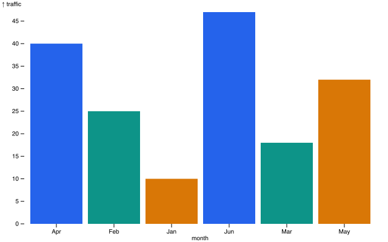

# pingplot

CLI that turns a CSV or JSON file into a chart — PNG by default, SVG or a
self-contained HTML page on request. Charts come from [Observable Plot](https://observablehq.com/plot):
Plot defaults for styling, with custom color palettes as the one option.



## Install

```sh
npm install -g pingplot
```

Or run from source (Node 18+, [pnpm](https://pnpm.io)):

```sh
pnpm install
pnpm link
```

## Use

```sh
printf 'month,traffic\nJan,10\nFeb,25\nMar,18\nApr,40\n' > report.csv
pingplot --data report.csv --mark bar --x month --y traffic
```

Writes `report.png` next to the data file and prints the path. The chart type
comes from `--mark`; match your data to a type in [catalog.md](catalog.md).

| Flag | Meaning |
| --- | --- |
| `--data <file>` | CSV or JSON input (`.json` = JSON, anything else = CSV) |
| `--mark <type>` | chart type: bar, line, area, dot, donut, box, heatmap, rule, funnel, sparkline |
| `--x <field>` | x channel (a field name in the data) |
| `--y <field>` | y channel |
| `--format <fmt>` | `png` \| `svg` \| `html` (default `png`) |
| `--color-range <hex,…>` | ordered colors → the color scale's `range` |
| `--interactive` | hover tooltips — html only; png/svg stay static |
| `--spec <file>` | a full Plot options object instead of inline flags |

### Formats

- **png** (default) — rendered server-side and rasterized.
- **svg** — the raw chart as a well-formed SVG file.
- **html** — a self-contained page that loads Plot from the CDN and renders in
  the browser, so it needs a network connection. `--interactive` adds hover
  tooltips here; png/svg never include them.

### Colors

Plot defaults everywhere — no theming. `--color-range` is the only
customization, and it maps straight to the color scale's `range`, so it works
for categorical, sequential, diverging, or cyclical scales:

```sh
pingplot --data report.csv --mark bar --x month --y traffic --color-range "#1d4ed8,#0f766e,#b45309"
```

For a reusable branded chart, put the palette in a spec file instead.

### Spec files

A spec file is a JSON Plot options object — the way to build a complex chart or
a branded one, with colors baked in. Marks are named by Plot constructor; data
can live in the file or come from `--data`:

```json
{
  "data": [{ "month": "Jan", "traffic": 10 }],
  "marks": [{ "type": "barY", "x": "month", "y": "traffic", "fill": "month" }],
  "color": { "range": ["#1d4ed8", "#0f766e"] }
}
```

```sh
pingplot --spec chart.json
```

Spec files render the same chart as equivalent inline flags. Donut is the one
type a spec file can't express (Plot has no donut mark — pingplot draws it with
`d3-shape`), so donut is inline flags only.

## Chart catalog

[catalog.md](catalog.md) lists every chart type with the data shape it expects,
the Plot marks behind it, and when to reach for it.

## How it works

pingplot builds one JSON-serializable chart description — the data, the marks
(named by Plot constructor), and plot options — and renders it two ways:
server-side with Plot in jsdom for PNG and SVG, or embedded in a self-contained
HTML page that rebuilds the same chart in the browser. Inline flags and
`--spec` files both produce a description, so the two render paths can't drift.
Donut is the exception: Plot has no donut mark, so pingplot draws it with
`d3-shape`.

## Develop

```sh
pnpm test
```

The suite covers parsing, loading, spec building, all three output formats, the
client-side HTML script, and a catalog loop that renders every chart type from
a committed fixture.

## License

[MIT](LICENSE)